# NutriPilot AI - Project Plan

> **Hackathon**: Commit to Change: An AI Agents Hackathon
> **Duration**: 4 weeks (4 × 5 day sprints)
> **Goal**: Build an autonomous nutrition agent demonstrating Observe-Think-Act with Opik observability

---

## Sprint Overview

```mermaid
gantt
    title NutriPilot 24-Hour Build
    dateFormat HH:mm
    axisFormat %H:%M
    
    section Setup
    Sprint 1 - Foundation     :s1, 00:00, 2 days
    
    section Core
    Sprint 2 - Orchestrator   :s2, after s1, 3 days
    
    section Agents
    Sprint 3 - Sub-Agents     :s3, after s2, 5 days
    
    section Integration
    Sprint 4 - Tools & Eval   :s4, after s3, 5 days
    
    section Frontend
    Sprint 5 - API & UI       :s5, after s4, 2 days
    
    section Polish
    Sprint 6 - Demo Ready     :s6, after s5, 3 days
```



---

## Sprint 1: Foundation & Setup (Hours 0-4)

### Objective
Set up the project skeleton, dependencies, and validate all API connections.

### Tasks

| # | Task | Time | Priority |
|---|------|------|----------|
| 1.1 | Initialize project with `pyproject.toml` (Poetry/uv) | 15m | P0 |
| 1.2 | Create folder structure (`/core`, `/agents`, `/tools`, `/eval`) | 15m | P0 |
| 1.3 | Set up `.env` with API keys (Gemini, Opik, USDA) | 15m | P0 |
| 1.4 | Install core dependencies | 20m | P0 |
| 1.5 | Validate Gemini API connection with test image | 30m | P0 |
| 1.6 | Validate Opik connection and create project | 30m | P0 |
| 1.7 | Validate USDA API with test query | 20m | P0 |
| 1.8 | Create `MealState` Pydantic schema in `/core/state.py` | 45m | P0 |
| 1.9 | Create workspace rules file | 10m | P1 |
| 1.10 | Write initial README.md | 20m | P1 |

### Dependencies
```toml
[project]
dependencies = [
    "google-genai>=1.0.0",
    "opik>=1.0.0",
    "pydantic>=2.0",
    "fastapi>=0.109.0",
    "uvicorn[standard]>=0.27.0",
    "httpx>=0.27.0",
    "python-dotenv>=1.0.0",
    "pycalib>=0.1.0",
]
```

### Milestone
✅ All APIs responding, schema defined, project structure ready

---

## Sprint 2: Core Orchestrator (Hours 4-8)

### Objective
Build the `StudioOrchestrator` with basic Observe-Think-Act loop.

### Tasks

| # | Task | Time | Priority |
|---|------|------|----------|
| 2.1 | Create `BaseAgent` abstract class | 30m | P0 |
| 2.2 | Implement `StudioOrchestrator` skeleton | 45m | P0 |
| 2.3 | Add Opik `@track` decorators to orchestrator | 30m | P0 |
| 2.4 | Create prompt templates in `/core/prompts.py` | 45m | P0 |
| 2.5 | Implement MealState transitions | 30m | P0 |
| 2.6 | Write unit tests for state transitions | 30m | P1 |
| 2.7 | Test basic flow with mock agents | 30m | P0 |

### Key Code

```python
# core/orchestrator.py
class StudioOrchestrator:
    async def process(self, input: OrchestratorInput) -> MealState:
        state = MealState(session_id=str(uuid4()), user_id=input.user_id)
        
        # OBSERVE
        state = await self.observe(state, input)
        
        # THINK
        state = await self.think(state)
        
        # ACT
        state = await self.act(state)
        
        return state
```

### Milestone
✅ Orchestrator runs end-to-end with placeholder agents, traces visible in Opik

---

## Sprint 3: Sub-Agents Development (Hours 8-12)

### Objective
Implement the three specialized agents with real Gemini integration.

### Tasks

| # | Task | Time | Priority |
|---|------|------|----------|
| 3.1 | Implement `VisionAnalyst` with Gemini 2.0 Flash | 75m | P0 |
| 3.2 | Add pixel-precise pointing for portion estimation | 45m | P0 |
| 3.3 | Implement OCR extraction for receipts | 30m | P1 |
| 3.4 | Implement `BioDataScout` with mock data | 45m | P0 |
| 3.5 | Implement `NutriAuditor` logic | 45m | P0 |
| 3.6 | Integration test: VisionAnalyst → NutriAuditor | 30m | P0 |

### VisionAnalyst Prompt Strategy

```python
VISION_SYSTEM_PROMPT = """
You are a food analysis expert. Analyze the image and:
1. Identify all visible food items
2. Estimate portion sizes in grams
3. Provide bounding box coordinates [x1, y1, x2, y2] normalized 0-1
4. Rate your confidence for each item (0-1)

Return JSON: {"foods": [{"name": str, "portion_grams": float, 
    "bounding_box": [float], "confidence": float}]}
"""
```

### Milestone
✅ All three agents functional with real Gemini calls, proper error handling

---

## Sprint 4: Tools & Evaluation (Hours 12-16)

### Objective
Integrate external tools and set up evaluation pipeline.

### Tasks

| # | Task | Time | Priority |
|---|------|------|----------|
| 4.1 | Implement USDA API wrapper | 45m | P0 |
| 4.2 | Create HealthKit mock with realistic data | 30m | P0 |
| 4.3 | Implement Opik logger utilities | 30m | P0 |
| 4.4 | Set up Pycalib calibration for VisionAnalyst | 45m | P1 |
| 4.5 | Create custom Opik metrics (hallucination, accuracy) | 45m | P1 |
| 4.6 | Create test dataset (10 food images) | 30m | P1 |
| 4.7 | Run evaluation experiment | 30m | P1 |

### USDA API Integration

```python
# tools/usda_api.py
class USDAClient:
    BASE_URL = "https://api.nal.usda.gov/fdc/v1"
    
    async def search_foods(self, query: str) -> List[FoodItem]:
        # Search FoodData Central
        ...
    
    async def get_nutrition(self, fdc_id: str) -> NutritionData:
        # Get detailed nutrient breakdown
        ...
```

### Milestone
✅ Full pipeline with real nutrition data, evaluation dashboard in Opik

---

## Sprint 5: API & Frontend (Hours 16-20)

### Objective
Build FastAPI backend and Next.js frontend for demo.

### Tasks

| # | Task | Time | Priority |
|---|------|------|----------|
| 5.1 | Create FastAPI app with CORS | 20m | P0 |
| 5.2 | Implement `/analyze` endpoint (image upload) | 45m | P0 |
| 5.3 | Implement `/user/{id}/state` endpoint | 30m | P0 |
| 5.4 | Initialize Next.js project | 20m | P0 |
| 5.5 | Build image upload component | 45m | P0 |
| 5.6 | Build MealState display component | 45m | P0 |
| 5.7 | Add real-time updates (polling/SSE) | 30m | P1 |
| 5.8 | Deploy to Vercel | 15m | P0 |

### API Endpoints

```python
# api/routes.py
@app.post("/analyze")
async def analyze_meal(
    image: UploadFile,
    user_id: str = Form(...),
    meal_type: Optional[str] = Form(None)
) -> MealState:
    """Main endpoint for food analysis."""
    ...

@app.get("/user/{user_id}/history")
async def get_history(user_id: str) -> List[MealState]:
    """Retrieve past meal analyses."""
    ...
```

### Milestone
✅ Working demo: upload image → see analysis in browser

---

## Sprint 6: Polish & Demo Prep (Hours 20-24)

### Objective
Fix bugs, optimize UX, prepare demo materials.

### Tasks

| # | Task | Time | Priority |
|---|------|------|----------|
| 6.1 | Fix any critical bugs from testing | 60m | P0 |
| 6.2 | Improve error messages and loading states | 30m | P0 |
| 6.3 | Add demo data and sample images | 30m | P0 |
| 6.4 | Record demo video (2-3 min) | 45m | P0 |
| 6.5 | Write submission README | 30m | P0 |
| 6.6 | Capture Opik dashboard screenshots | 15m | P0 |
| 6.7 | Final testing across scenarios | 30m | P0 |
| 6.8 | Buffer time for issues | 30m | - |

### Demo Flow Script

1. **Hook** (30s): "Meet NutriPilot - your AI nutrition co-pilot"
2. **Problem** (30s): "Tracking nutrition is tedious and inaccurate"
3. **Solution Demo** (90s):
   - Upload food photo
   - Show real-time analysis
   - Display health constraint check
   - Show meal adjustments
4. **Tech Highlights** (30s): 
   - Gemini 2.0 Flash pixel-pointing
   - Opik observability traces
   - Pydantic type-safe handoffs

### Milestone
✅ Submission-ready with video, screenshots, working demo URL

---

## Risk Mitigation

| Risk | Likelihood | Impact | Mitigation |
|------|------------|--------|------------|
| Gemini API rate limits | Medium | High | Cache responses, use test fixtures |
| USDA API downtime | Low | Medium | Pre-fetch common foods, fallback data |
| Complex image failures | High | Medium | Graceful degradation, confidence thresholds |
| Vercel build issues | Low | Medium | Test deployment early (Sprint 5) |
| Time overrun | Medium | High | P1 tasks are cuttable, maintain MVP focus |

---

## Success Criteria

### Must Have (MVP)
- [ ] Upload image → get food analysis
- [ ] Display nutritional breakdown
- [ ] Show health constraint warnings
- [ ] Opik traces for all requests
- [ ] Deployed frontend

### Nice to Have
- [ ] Receipt OCR
- [ ] Confidence calibration
- [ ] Historical meal tracking
- [ ] Custom dietary goals

---

## Submission Checklist

- [ ] Demo video (2-3 min, unlisted YouTube)
- [ ] GitHub repo (public)
- [ ] Live demo URL (Vercel)
- [ ] README with setup instructions
- [ ] Opik project link (if public)
- [ ] Architecture diagram
- [ ] Team info
