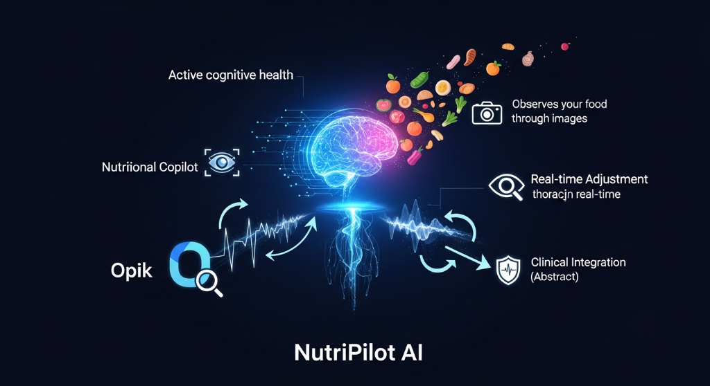

# 🍽️ NutriPilot AI

> **Your AI-powered nutrition co-pilot with full observability**

[](https://lablab.ai)
[](https://ai.google.dev/)
[](https://www.comet.com/opik)

NutriPilot transforms food photos into personalized nutrition insights using a multi-agent ReAct architecture. Built for the **"Commit to Change" AI Agents Hackathon**.



---

## 🎯 Problem

Manual nutrition tracking is:
- **Tedious**: Logging a complex meal takes 10-15 minutes
- **Inaccurate**: Portion estimation errors of 30-50% are common  
- **Impersonal**: Generic apps ignore your health goals and conditions

## 💡 Solution

NutriPilot uses **Gemini 2.0 Flash** vision capabilities to:

1. 📸 **Instant Analysis**: Upload a food photo → get complete nutrition breakdown in seconds
2. 🎯 **Goal-Personalized Feedback**: Recommendations tailored to your health goals (weight loss, diabetes, heart health)
3. 📊 **Self-Improving**: Calibration system learns from verified meals to improve accuracy
4. 🔍 **Fully Observable**: Every AI decision traceable via Comet Opik

---

## 🏗️ Architecture

```
┌─────────────────────────────────────────────────────────────┐
│                    Next.js Frontend                          │
└─────────────────────────┬───────────────────────────────────┘
                          │
                          ▼
┌─────────────────────────────────────────────────────────────┐
│                    FastAPI Backend                           │
└─────────────────────────┬───────────────────────────────────┘
                          │
                          ▼
┌─────────────────────────────────────────────────────────────┐
│              StudioOrchestrator (ReAct Pattern)              │
│  ┌─────────┐    ┌─────────┐    ┌─────────┐                  │
│  │ OBSERVE │ ──▶│  THINK  │ ──▶│   ACT   │                  │
│  └─────────┘    └─────────┘    └─────────┘                  │
└────────┬────────────┬───────────────┬───────────────────────┘
         │            │               │
         ▼            ▼               ▼
┌──────────────┐ ┌──────────────┐ ┌──────────────┐
│VisionAnalyst │ │ NutriAuditor │ │GoalEvaluator │
│ (Gemini 2.0) │ │  (USDA API)  │ │ (Personalize)│
└──────────────┘ └──────────────┘ └──────────────┘
         │            │               │
         └────────────┴───────────────┘
                      │
                      ▼
            ┌──────────────────┐
            │    Comet Opik    │
            │  (Observability) │
            └──────────────────┘
```

### Multi-Agent System

| Agent | Role | Technology |
|-------|------|------------|
| **VisionAnalyst** | Food detection & portion estimation | Gemini 2.0 Flash Vision |
| **BioDataScout** | Fetch user health constraints | HealthKit (mock) |
| **NutriAuditor** | Validate nutrition data | USDA FoodData Central API |
| **GoalEvaluator** | Personalize recommendations | Goal-based rule engine |
| **NutriCalibrator** | Improve accuracy from feedback | Opik trace analysis |

---

## 🚀 Quick Start

### Prerequisites

- Python 3.11+
- Node.js 18+
- API Keys: Gemini, Opik, USDA (optional)

### Backend Setup

```bash
cd backend
python -m venv venv
source venv/bin/activate  # Windows: venv\Scripts\activate
pip install -r requirements.txt

# Configure environment
cp .env.example .env
# Edit .env with your API keys

# Run server
uvicorn app.main:app --reload --port 8000
```

### Frontend Setup

```bash
cd frontend
npm install

# Configure environment
cp .env.example .env.local
# Edit .env.local if needed

# Run dev server
npm run dev
```

Visit **http://localhost:3000** to use NutriPilot!

---

## 🔬 Key Features

### 1. Photo-to-Nutrition Analysis

```python
# Upload any food image
POST /analyze
Content-Type: multipart/form-data
image: <food_photo.jpg>
user_id: demo_user
```

Response includes:
- Detected foods with portions
- Complete macronutrient breakdown
- Goal-specific feedback
- Overall meal score

### 2. Personalized Goal System

Supported goals:
- 🏃 Weight Loss / Weight Gain
- 💪 Muscle Building
- ❤️ Heart Health
- 🩺 Diabetes Management
- ⚡ Energy & Vitality

### 3. Calibration & Self-Improvement

The calibration system:
1. Collects Opik traces from meal analyses
2. Compares estimated vs verified calories
3. Identifies systematic errors (e.g., "fried foods underestimated")
4. Generates prompt improvement suggestions

### 4. Full Observability with Opik

Every request is traced:
- `orchestrator.process` - Full analysis flow
- `vision_analyst.process` - Image analysis
- `nutri_auditor.process` - Nutrition validation  
- `goal_evaluator.process` - Personalization

---

## 📁 Project Structure

```
nutripilot/
├── backend/
│   ├── app/
│   │   ├── agents/          # AI agents
│   │   │   ├── vision_analyst.py
│   │   │   ├── nutri_auditor.py
│   │   │   ├── goal_evaluator.py
│   │   │   └── nutri_calibrator.py
│   │   ├── core/            # Orchestrator, state, schemas
│   │   ├── tools/           # External API wrappers
│   │   └── main.py          # FastAPI app
│   └── requirements.txt
├── frontend/
│   ├── app/                 # Next.js pages
│   ├── components/          # React components
│   │   ├── ImageUpload.tsx
│   │   ├── AnalysisResults.tsx
│   │   ├── Dashboard.tsx
│   │   └── CalibrationReport.tsx
│   └── package.json
├── opik_evals/              # Evaluation framework
│   ├── actionability_metric.py
│   ├── goal_adherence_metric.py
│   └── production_eval.py
└── README.md
```

---

## 🧪 Evaluation

Run the evaluation suite:

```bash
cd opik_evals
pip install -r requirements.txt
python run_evaluation.py
```

Custom metrics:
- **Actionability Score**: Are suggestions specific and actionable?
- **Goal Adherence Score**: Does feedback align with user goals?

---

## 🛠️ Tech Stack

| Layer | Technology |
|-------|------------|
| **LLM** | Google Gemini 2.0 Flash |
| **Backend** | FastAPI, Pydantic v2 |
| **Frontend** | Next.js 14, React, Tailwind CSS |
| **Observability** | Comet Opik |
| **Data** | USDA FoodData Central API |

---

## 📺 Demo

🎥 **[Watch Demo Video](https://www.youtube.com/watch?v=H08rlaXVW14)**

📊 **[Opik Dashboard](https://www.comet.com/opik/oabolade/nutripilot)**

---

## 👥 Team

Built with ❤️ for the **Commit to Change: An AI Agents Hackathon**

---

## 📄 License

MIT License - see [LICENSE](LICENSE) for details.
