# NutriPilot AI - System Architecture

> **Version**: 1.0 (Hackathon MVP)
> **Author**: Lead AI Architect
> **Last Updated**: January 2026

---

## High-Level Architecture

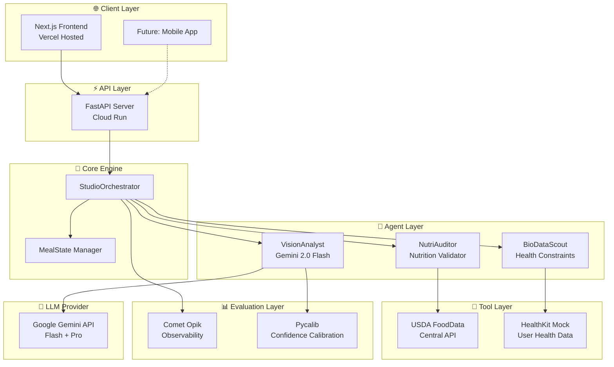

---

## Component Deep Dive

### 1. Client Layer

| Component | Technology | Purpose |
|-----------|------------|---------|
| **Frontend** | Next.js 14, React, Tailwind | User interface for image upload and result display |
| **Hosting** | Vercel | Edge deployment, automatic HTTPS |

**Key Features:**
- Drag-and-drop image upload
- Real-time analysis progress indicator
- Interactive meal breakdown visualization
- Health constraint alerts

---

### 2. API Layer

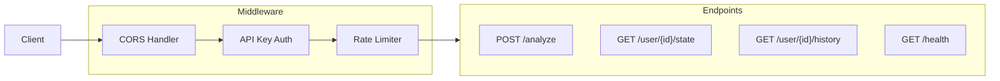

**Endpoint Details:**

| Endpoint | Method | Input | Output |
|----------|--------|-------|--------|
| `/analyze` | POST | `multipart/form-data` (image, user_id, meal_type) | `MealState` |
| `/user/{id}/state` | GET | Path param | Current `MealState` |
| `/user/{id}/history` | GET | Path param, query params | `List[MealState]` |
| `/health` | GET | - | `{"status": "ok"}` |

---

### 3. Core Engine

#### StudioOrchestrator

The central coordinator implementing the **Observe-Think-Act** pattern:

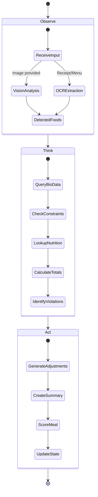

#### MealState Lifecycle

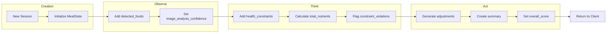

---

### 4. Agent Layer

#### VisionAnalyst

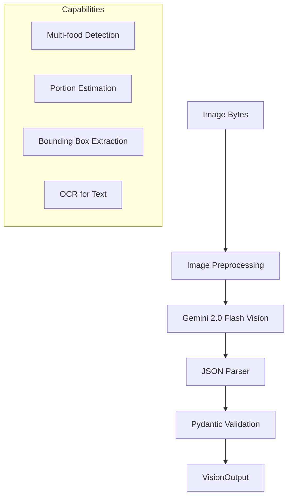

**Gemini Integration:**
- Model: `gemini-2.0-flash`
- Features: Bounding box output, structured JSON response
- Retry policy: 3 attempts with exponential backoff

#### BioDataScout

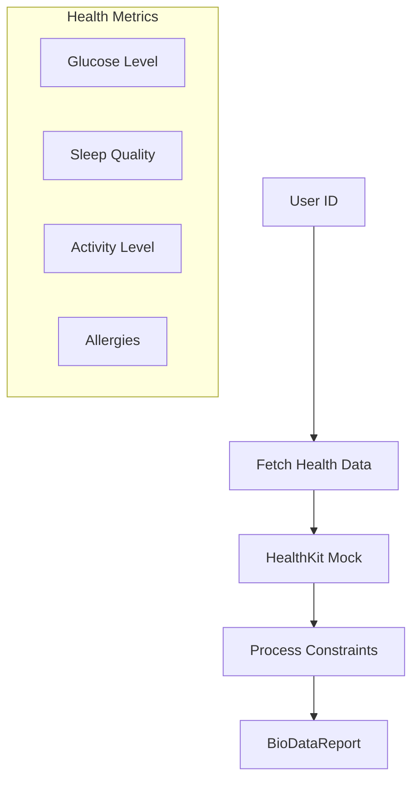

**Mock Data Schema:**
```python
{
    "glucose_mg_dl": 95,  # Normal: 70-100
    "sleep_quality": 0.7,  # 0-1 scale
    "activity_level": "moderate",
    "allergies": ["peanuts", "shellfish"],
    "dietary_restrictions": ["low_sodium"]
}
```

#### NutriAuditor

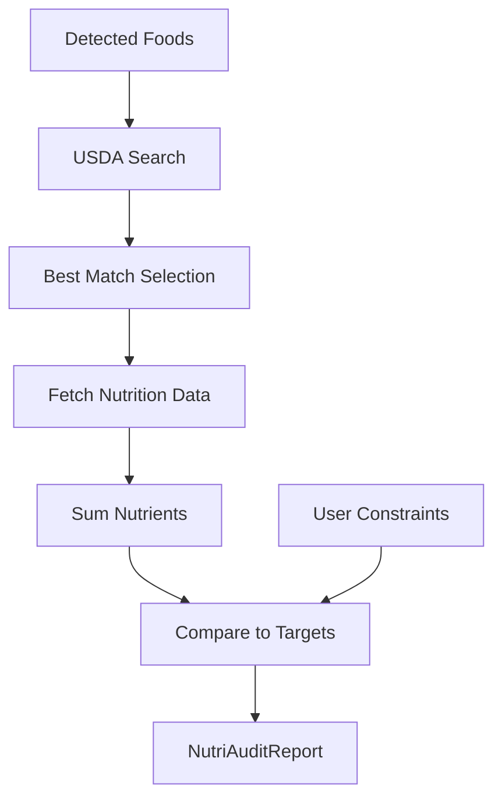

---

### 5. Tool Layer

#### USDA FoodData Central Integration

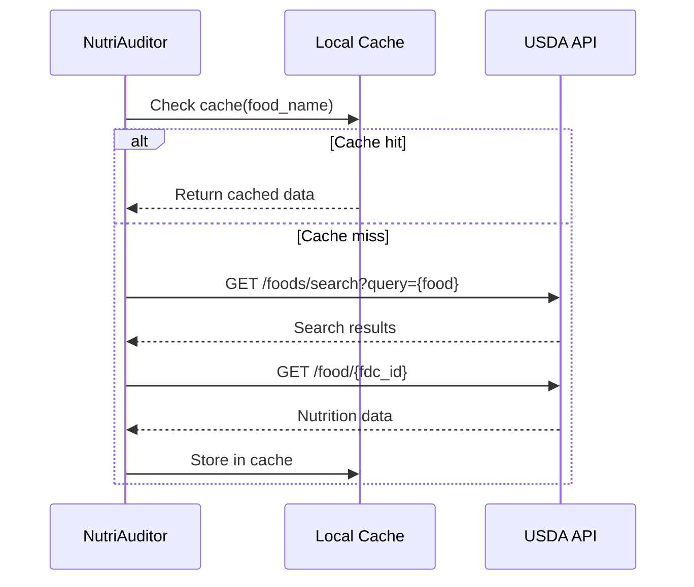

**API Details:**
- Endpoint: `https://api.nal.usda.gov/fdc/v1`
- Auth: API key in header
- Rate limit: 1000 requests/hour

#### HealthKit Mock

For hackathon demo, simulates Apple HealthKit data:

| Metric | Type | Range | Update Frequency |
|--------|------|-------|------------------|
| Glucose | float | 70-180 mg/dL | Per request (randomized) |
| Sleep | float | 0-1 | Daily |
| Steps | int | 0-20000 | Hourly |
| Heart Rate | int | 50-120 bpm | Per request |

---

### 6. Evaluation Layer

#### Opik Observability

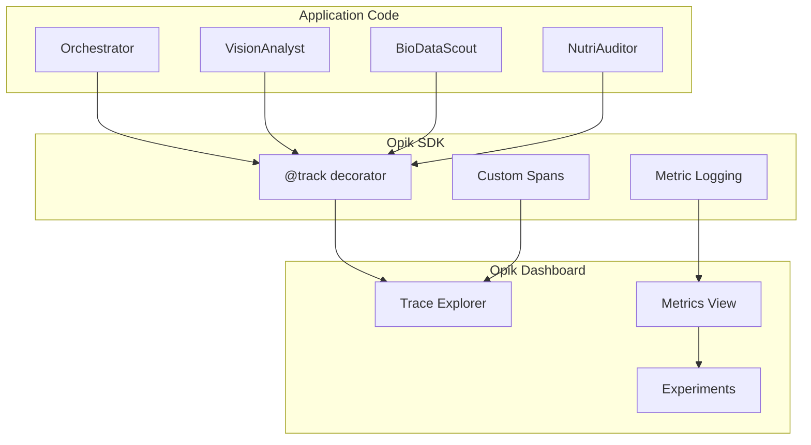

**Tracked Events:**

| Event | Metadata |
|-------|----------|
| `orchestrator.process` | session_id, user_id, meal_type |
| `vision_analyst.analyze` | image_size, model, latency_ms |
| `biodata_scout.query` | user_id, constraints_count |
| `nutri_auditor.audit` | foods_count, violations_count |
| `usda_api.search` | query, results_count, cached |

#### Pycalib Confidence Calibration

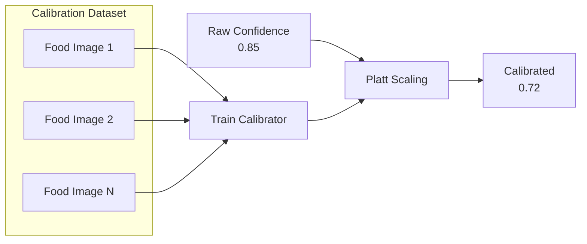

---

## Data Flow: End-to-End Request

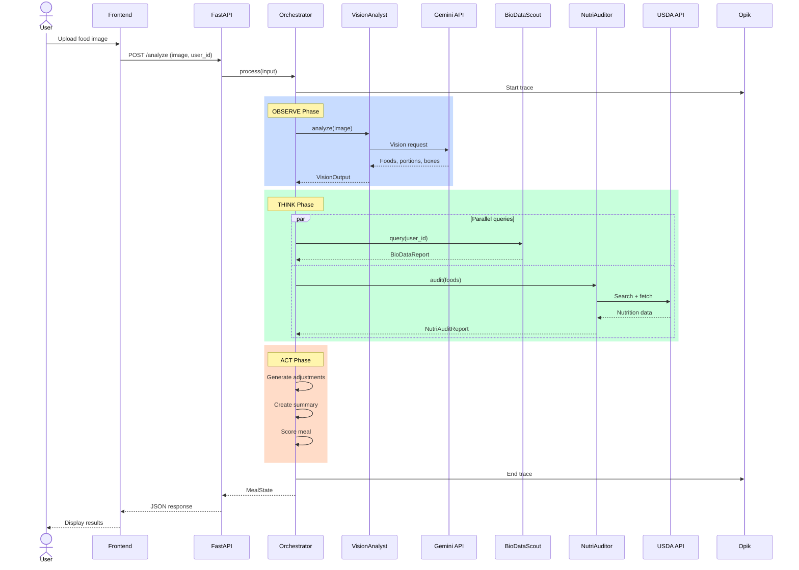

---

## Security Considerations

| Layer | Security Measure |
|-------|------------------|
| **API** | API key authentication, CORS whitelist |
| **Secrets** | Environment variables, never in code |
| **User Data** | No PII stored, session-based |
| **LLM** | Input sanitization, output validation |

---

## Deployment Architecture

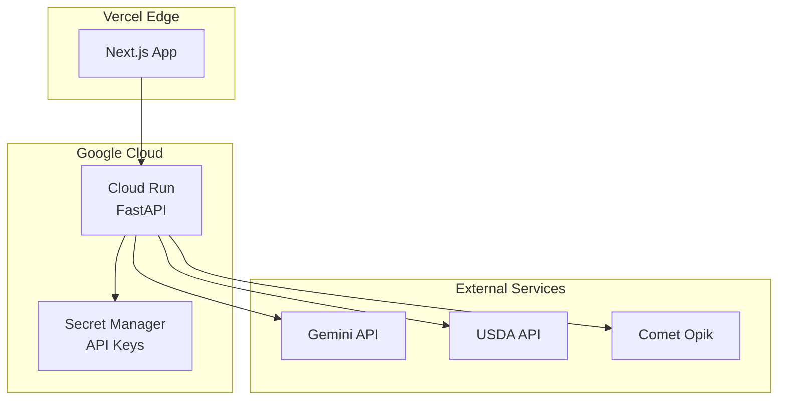

**Environment Variables:**
```bash
GEMINI_API_KEY=...
OPIK_API_KEY=...
USDA_API_KEY=...
OPIK_PROJECT_NAME=nutripilot
ENVIRONMENT=production
```

---

## Performance Targets

| Metric | Target | Measurement |
|--------|--------|-------------|
| End-to-end latency | < 5s | API response time |
| Vision analysis | < 2s | VisionAnalyst duration |
| USDA lookup | < 500ms | Cached 95% of requests |
| Frontend load | < 2s | Lighthouse score > 90 |

---

## Future Extensions

1. **Real HealthKit Integration**: iOS app with native HealthKit access
2. **Meal Planning**: Proactive meal suggestions based on nutrient gaps
3. **Multi-language Support**: OCR and responses in multiple languages
4. **Continuous Learning**: Fine-tune portion estimation with user feedback
5. **Wearable Integration**: Real-time glucose monitoring (CGM)
